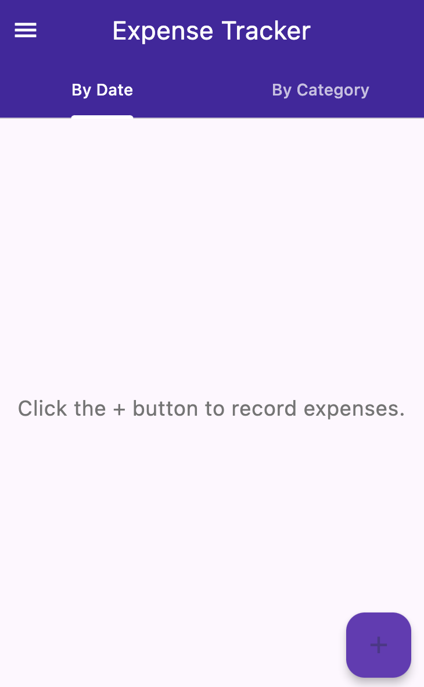
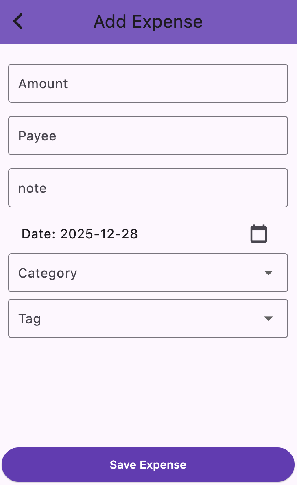
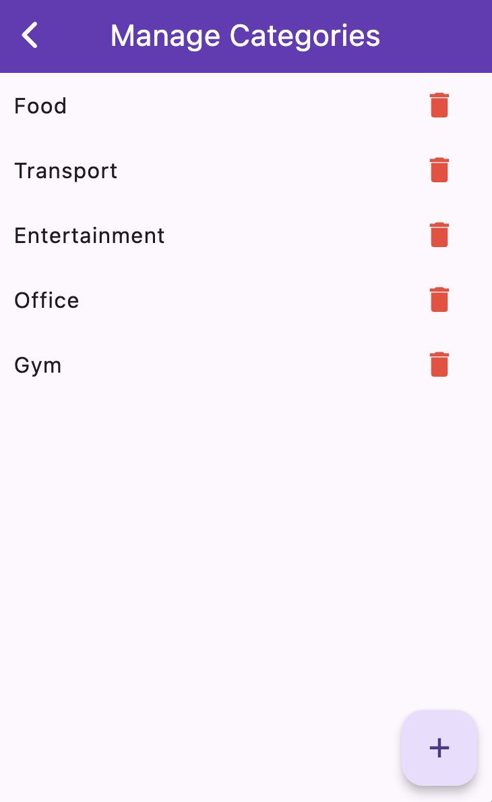
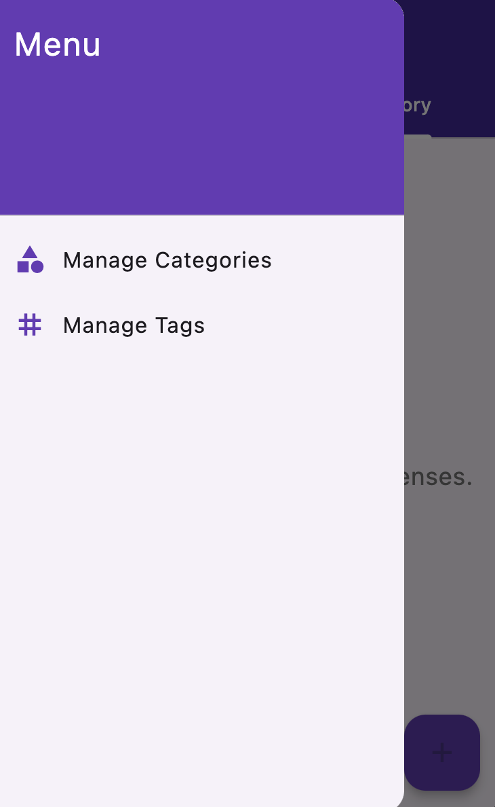

# 📱 Expense Manager (Flutter)

A simple and clean **Expense Management app** built with Flutter.  
The app allows users to track expenses, manage categories and tags, and persist data locally.

This project was created as part of a Flutter practice course and is suitable for showcasing Flutter fundamentals, state management, and local persistence.

---

## ✨ Features

- 📋 View a list of all expenses
- ➕ Add new expenses with:
  - Payee
  - Amount
  - Notes
  - Date
  - Category
  - Tag
- 🗂 Group expenses by category
- ❌ Delete expenses
- ⚙️ Manage categories and tags
- 💾 Local data persistence (offline support)

---

## 🛠 Tech Stack

- Flutter
- Dart
- Provider (state management)
- LocalStorage (persistent storage)
- Intl (date & formatting)

---

## 📸 Screenshots

<p float="left">
  
  
  
  
</p>

---

## 🧱 Project Structure

```
lib/
├── models/        # Data models (Expense, Category, Tag)
├── providers/     # State management (ExpenseProvider)
├── screens/       # App screens (Home, Add Expense, Settings)
├── widgets/       # Reusable UI components
└── main.dart      # App entry point
```

**Why this structure?**
- Clear separation of concerns
- Scalable and maintainable architecture
- Easy to extend (e.g. Firebase integration in the future)

---

## 🚀 Getting Started

1. **Clone the repository**
   ```bash
   git clone https://github.com/arterorx/expense-manager.git
   cd expense-manager
   ```

2. **Install dependencies**
   ```bash
   flutter pub get
   ```

3. **Run the app**
   ```bash
   flutter run
   ```

---

## 🎯 Learning Goals

This project demonstrates:

- Clean Flutter architecture
- State management with ChangeNotifier
- CRUD operations
- JSON serialization / deserialization
- Local data persistence
- Reusable widgets
- Multi-screen navigation

---

## 👤 Author

**Armen Ter-Oganezov**  
Flutter Developer | 🇩🇪 Germany  
GitHub: [arterorx](https://github.com/arterorx)